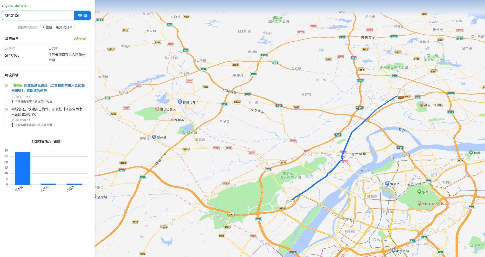
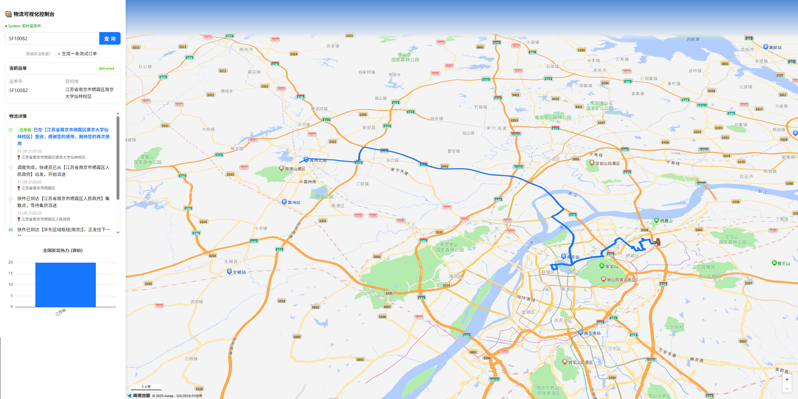

# 电商物流配送可视化平台 - 项目依赖说明

## 项目概述

本项目是一个电商物流配送可视化平台，采用前后端分离架构，包含一键启动脚本、React前端可视化界面和Node.js后端服务。
## 界面展示
同城即送

物流派送

## 项目结构

```
platform/
├── frontend/          # React + TypeScript 前端项目
├── backend/           # Node.js + Express 后端项目
└── package.json       # 根目录配置（用于一键启动）
```

## 依赖包完整清单

### 1. 根目录 (platform/)

**功能**: 一键启动前后端服务

**开发依赖 (devDependencies)**:
- `concurrently`: 并行运行多个命令的工具

**安装命令**:
```bash
npm install concurrently --save-dev
```

### 2. 前端项目 (platform/frontend/)

**技术栈**: React + TypeScript + Vite + Ant Design + ECharts + 高德地图

**生产依赖 (dependencies)**:
- `react`: React 框架
- `react-dom`: React DOM 渲染
- `react-router-dom`: React 路由管理
- `antd`: 蚂蚁金服 UI 组件库
- `@ant-design/icons`: Ant Design 图标库
- `@amap/amap-jsapi-loader`: 高德地图 JSAPI 加载器
- `echarts`: 百度数据可视化图表库
- `echarts-for-react`: ECharts 的 React 封装组件
- `dayjs`: 轻量级时间处理库

**开发依赖 (devDependencies)**:
- `typescript`: TypeScript 语言支持
- `vite`: 构建工具
- `@vitejs/plugin-react`: Vite 的 React 插件
- `@types/node`: Node.js 类型定义
- `@types/react`: React 类型定义
- `@types/react-dom`: React DOM 类型定义

**安装命令**:
```bash
cd frontend
npm install antd @ant-design/icons @amap/amap-jsapi-loader echarts echarts-for-react dayjs react-router-dom
npm install -D typescript @types/node @types/react @types/react-dom
```

### 3. 后端项目 (platform/backend/)

**技术栈**: Node.js + Express + TypeScript + MongoDB + WebSocket + Axios

**生产依赖 (dependencies)**:
- `express`: Web 服务框架
- `mongoose`: MongoDB 对象模型工具
- `cors`: 跨域资源共享中间件
- `ws`: WebSocket 库
- `axios`: HTTP 客户端
- `dayjs`: 时间处理库

**开发依赖 (devDependencies)**:
- `typescript`: TypeScript 语言支持
- `ts-node`: 直接运行 .ts 文件
- `nodemon`: 文件监听自动重启
- `@types/express`: Express 类型定义
- `@types/node`: Node.js 类型定义
- `@types/cors`: CORS 类型定义
- `@types/ws`: WebSocket 类型定义

**安装命令**:
```bash
cd backend
npm install express mongoose cors ws axios dayjs
npm install -D typescript ts-node nodemon @types/node @types/express @types/cors @types/ws
```

## 主要功能模块对应的依赖

### 地图可视化
- `@amap/amap-jsapi-loader`: 高德地图集成
- `antd`: UI 组件布局

### 数据图表
- `echarts` & `echarts-for-react`: 物流数据可视化

### 实时通信
- `ws`: WebSocket 实时推送坐标和状态

### 数据存储
- `mongoose`: MongoDB 数据库操作

### API 服务
- `express`: RESTful API 提供
- `axios`: 外部 API 调用（地理编码服务）

### 开发工具
- `concurrently`: 并行启动服务
- `nodemon`: 开发热重载
- `vite`: 前端构建和开发服务器

## 环境要求

- Node.js: 14.0 或更高版本
- MongoDB: 4.0 或更高版本
- 现代浏览器（支持 ES6+）